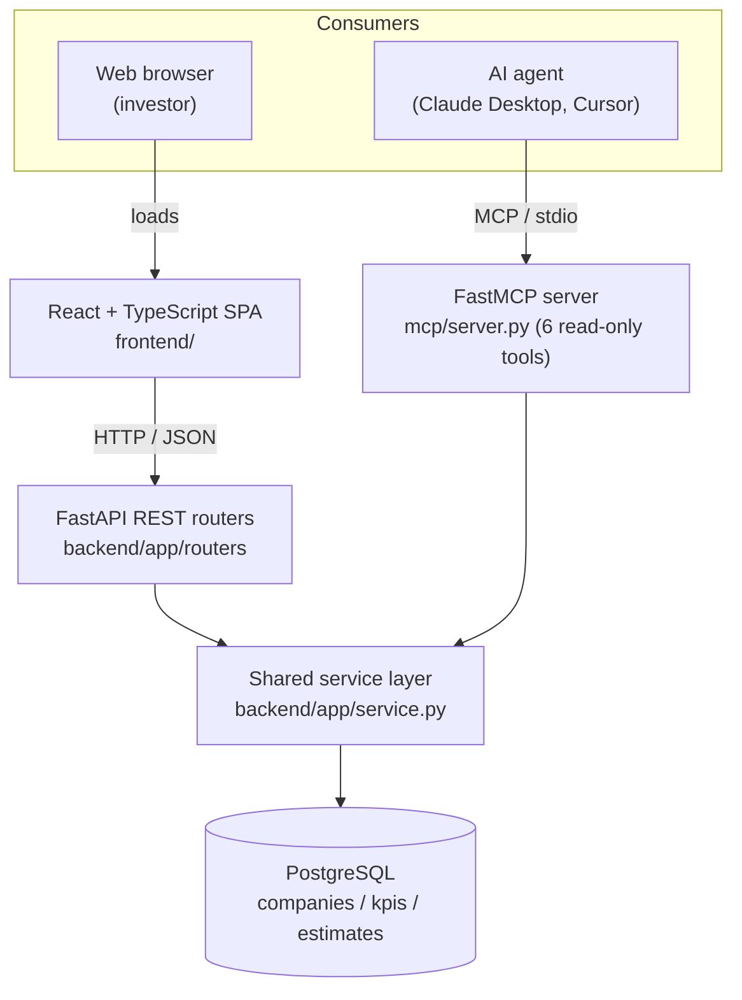

# KPI Estimates Portal

A full-stack application that shows quarterly KPI estimates to time-constrained
public-market investors, served through two channels: a web frontend for human
users and an MCP (Model Context Protocol) server for AI agents. Built for the
YipitData Senior Software Engineer assignment.

## Overview

Public-market investors need key performance indicators (KPIs) such as revenue,
units sold, and subscriber growth for the companies they follow, and they need
them fast. This app gives them a **glanceable** view: a searchable company
directory leads to a company page that summarizes that company's KPIs at a
glance, each card carrying a **QoQ** (quarter-over-quarter) and **YoY**
(year-over-year) trend signal so direction reads without studying a line, and
any KPI drills down to a detailed chart of its closed-quarter history and
quarter-to-date snapshots. It saves investors the effort of digging through raw
estimates.

The trend signals are closed-quarter percent changes (QoQ against the previous
quarter, YoY against the same quarter last year). They are computed only from
**historical** data: a QTD value is partial and cumulative-to-date, so a
cross-quarter comparison of it would mislead. They are also computed from the
full history, so they stay stable when the chart's date filter narrows the
view. The detail chart goes further: each of its two panels also shows the
percent change across exactly the range on screen, which by contrast does move
with the filter.

The dataset covers 20 companies across 18 sectors, 5 KPIs, and 100
`(company, KPI)` series. Each series has two parts: a **history** of closed
fiscal quarters and a **QTD** (quarter-to-date) view of the in-progress quarter.

The same data is served to two audiences. Human users get a React web app. AI
agents (Claude Desktop, Cursor, and similar) get an MCP server with six
read-only tools. Both are backed by one shared service layer, so query logic is
written once.

## Architecture



**Two entry points, one shared core.** The REST API and the MCP server are thin
adapters. All KPI and QTD query logic lives in `backend/app/service.py`, a layer
of pure functions that take a database session and return typed Pydantic models.
The MCP server imports that package in-process and calls the exact same
functions the REST routers call, so there is no duplicated query logic and no
second network hop. This is the structural answer to one of the assignment's key
technical challenges.

The full architecture reference, including the database ERD and the request
flow, is in [`docs/architecture.md`](docs/architecture.md).

### The QTD model

Modeling QTD correctly is the heart of the assignment.

A **historical** estimate is one value per closed fiscal quarter. A **QTD**
estimate is not a single value: the in-progress quarter has several intra-quarter
**snapshots**, each stamped with an `as_of` date, showing how the estimate
evolved. The **current QTD** value is the snapshot with the latest `as_of`.

Both kinds of row live in one `estimates` table, discriminated by an
`estimate_type` column, with a nullable `as_of` and a `CHECK` constraint that
enforces the invariant (a historical row has no `as_of`, a QTD row must have
one). Current QTD is **derived on read**, never stored, so there is no second
source of truth to keep in sync. It is resolved with a PostgreSQL `DISTINCT ON`
ordered by `as_of DESC, created_at DESC, id DESC`; the `id` term (a monotonic
`BIGSERIAL`) is the guaranteed-unique tiebreak so a re-published correction at
the same `as_of` resolves deterministically to the most recent write.

Publishing (`POST /estimates`) is **append-only**: it inserts a row and never
updates or deletes one. This preserves a full audit trail and matches the
snapshot model, since a new QTD estimate is itself a new snapshot.

## Technology choices

| Area | Choice | Why |
|------|--------|-----|
| Backend framework | **FastAPI** | Async, typed, Pydantic-native, generates an OpenAPI schema. Recommended by the assignment and a strong fit for a thin, typed API. |
| Database | **PostgreSQL** | The assignment states the data already lives in Postgres. Its `DISTINCT ON` and partial indexes are exactly what the QTD "latest snapshot" query needs. |
| ORM | **SQLAlchemy 2.0** | The modern typed `select()` API, full control over the QTD query, no hidden magic to defend live. |
| Validation | **Pydantic v2** | One set of models is the API contract for both the REST layer and the MCP layer. Cross-field rules (the QTD invariant) are validated declaratively. |
| MCP framework | **FastMCP** | The standard Python framework for MCP servers. Recommended by the assignment; turns typed functions into discoverable tools with generated input and output schemas. |
| Frontend | **React + TypeScript (strict)** | Conventional, component-based, fully typed end to end against the API contract. |
| Build tool | **Vite** | Fast dev server and build; ships Vitest for the unit tests. |
| Routing | **React Router** | The standard SPA router; maps the four URLs to pages. |
| Charts | **Recharts** | Declarative React charting for the detailed history and QTD chart. Code-split so the directory and company pages never download it. |
| Local orchestration | **Docker Compose** | One command brings up a seeded database and the API. |

Deliberately **not** used: no Redux or React Query (local state is enough), no
GraphQL, no repository pattern, no Alembic (see Future improvements), no ORM
lazy-loading tricks. Every file is meant to be simple enough to explain and
defend in a live review.

## Design

The web frontend follows a documented design system,
[`docs/design-system.md`](docs/design-system.md), derived from YipitData's
published design language. It fixes the color tokens (built from YipitData's
Charts and Visualizations palette), the typography (Roboto for UI text, Roboto
Mono for every number and chart axis label), spacing, component styling, and
the data-visualization rules the detail chart follows. The target is an
institutional research terminal, a "data desk": numbers are the product,
hairline rules separate content instead of shadows, and color is reserved for
state and data series.

## Reliability, performance, and scalability

**Performance.** The users are time-constrained, so reads are tuned for speed.
`estimates` carries a `(company_id, kpi_id)` index and a partial index for the
QTD path. The `GET /overview` endpoint runs a **constant three queries**
assembled in Python, never one query per series; a query-counting test proves
there is no N+1. Current QTD is a single index-backed `DISTINCT ON`. On the
frontend, the chart library is code-split into its own chunk, so the directory
and company pages load only ~78 kB of gzipped JavaScript, and the company
page's summary sparklines are hand-rolled SVG rather than full chart instances.

**Reliability.** Writes are append-only, so no request can destroy data.
Database `CHECK` constraints are a final backstop behind Pydantic validation.
`created_at` is set server-side. The seed is idempotent (re-running it is a
no-op). Each request runs in one transaction. `GET /health` probes the database
and returns 503 if it is unreachable, so a load balancer can act on the status
code.

**Scalability.** The API is stateless, so it scales horizontally behind a load
balancer. The read-heavy workload fits PostgreSQL comfortably at this size. The
path beyond it is documented as future work: read replicas, a materialized view
or a `latest_qtd` flag for current QTD, and a cache for the overview.

## Observability, monitoring, and auditing

**Implemented:**

- **Structured JSON logging.** Every log line is a single JSON object
  (`timestamp`, `level`, `logger`, `message`, plus `request_id`, `method`,
  `path`, `status`, `latency_ms` where relevant), ready for a log aggregator
  with no custom parsing.
- **Request IDs.** The request-logging middleware assigns each request a
  `request_id`, carried in a contextvar so every line emitted while handling
  that request (including the publish audit line) shares it, and returned in the
  `X-Request-ID` response header. An inbound `X-Request-ID` is reused, for trace
  continuity across services.
- **Request timing.** The same middleware times every request and logs the
  latency. An unhandled error is logged as a 500 before being re-raised, so
  failures are never missing from the log.
- **Health check.** `GET /health` runs a trivial query and reports database
  connectivity, returning 503 on failure.
- **Auditing.** Publishing is append-only, so the `estimates` table is itself an
  audit trail: every estimate ever published, including same-`as_of`
  corrections, is preserved with its server-set `created_at`. The service layer
  also emits a structured audit line on each publish.
- **Consistent error contract.** Every error response is JSON with a `detail`
  key (404, 422, 500 alike); the 500 body is generic so it leaks no internals.

**MCP channel.** The REST API has the full structured-logging stack above. The
MCP server deliberately relies on FastMCP's own logging to stderr: with stdio
transport, stdout is the JSON-RPC protocol channel, so a stdout log handler
would corrupt it. The six MCP tools surface failures through typed `ToolError`
messages instead.

**Known limitation.** `GET /health` is logged at `INFO` on every call. Under a
real uptime probe that is noisy; a production setup would log it at `DEBUG` or
exclude it from the access log.

**Forward plan.** A Prometheus `/metrics` endpoint with dashboards; shipping the
JSON logs to an aggregator (Loki, ELK, or similar); alerting on error-rate and
p95-latency SLOs; a `published_by` field on the publish endpoint once
authentication exists; and OpenTelemetry tracing across the REST, service, and
MCP layers.

## Running the project

### Prerequisites

- **Docker** and Docker Compose (Docker Desktop).
- **Node.js 20+** and npm, for the frontend.
- **Python 3.12+**, only to run the test suites and the MCP server on the host.

### Backend and database (one command)

```bash
docker compose up --build
```

This builds the backend image, starts PostgreSQL, runs the idempotent seed (20
companies, 5 KPIs, 2000 estimates), and serves the API at
`http://localhost:8000`. The Compose stack sets its own environment, so no `.env`
file is needed for this step.

Verify it:

```bash
curl http://localhost:8000/health      # -> {"status":"ok","db":"ok"}
curl http://localhost:8000/companies   # -> 20 companies
```

**Two database URLs, by design.** Inside the Compose network the backend reaches
PostgreSQL at `db:5432`. On the host, processes reach the same database at
`localhost:5433` (host port 5433 avoids colliding with a PostgreSQL already
installed on 5432). The host value is in `.env.example`.

### Frontend

```bash
cd frontend
npm install
npm run dev
```

Vite serves the app at `http://localhost:5173`. The port is pinned, because it
must match the backend's CORS allow-list. To point the app at a non-default API,
copy `frontend/.env.example` to `frontend/.env.local` and set `VITE_API_BASE_URL`
(the default is `http://localhost:8000`).

### Tests

Backend and MCP (Python), in a virtualenv:

```bash
python -m venv .venv && source .venv/bin/activate   # Windows: .venv\Scripts\activate
pip install -e "./backend[dev]" -e "./mcp[dev]"
cp .env.example .env                                 # Windows: Copy-Item .env.example .env
docker compose up -d db                              # the tests need PostgreSQL

cd backend && pytest                                 # service-layer and API tests
cd ../mcp && pytest                                  # MCP server tests
```

The backend tests run against a separate `kpi_test` database, created
automatically on first run.

Frontend (TypeScript):

```bash
cd frontend
npm run test        # unit tests on the pure lib/ modules
npm run typecheck   # strict-mode type check
npm run lint
```

## Connecting the MCP server from an AI client

The MCP server runs on the host over stdio and is launched by the AI client. It
needs the virtualenv from the Tests section (with `kpi-backend` and `kpi-mcp`
installed) and the database running (`docker compose up -d db`).

### Claude Desktop

Edit `claude_desktop_config.json` (Settings -> Developer -> Edit Config):

```json
{
  "mcpServers": {
    "kpi-estimates": {
      "command": "/absolute/path/to/.venv/bin/python",
      "args": ["/absolute/path/to/yipitdata-takehome/mcp/server.py"]
    }
  }
}
```

On Windows the command is `...\.venv\Scripts\python.exe`. No `env` block is
needed: `config.py` locates the repo-root `.env` by an absolute path, so the
server finds `DATABASE_URL` whatever the working directory. Restart Claude
Desktop; the six tools appear:

- **`search_companies`** finds companies by ticker, name, or sector.
- **`list_kpis`** lists every KPI and its unit.
- **`get_company`** returns one company profile and the KPIs it reports.
- **`get_company_estimates`** returns every KPI series for one company in a
  single call.
- **`get_kpi_estimates`** returns the full history and QTD snapshots for one
  `(company, KPI)` series.
- **`get_current_qtd`** returns only the latest QTD snapshot for a series.

Ask, for example: "What is the current QTD revenue estimate for ACME?"

### Testing the server directly

The MCP Inspector runs the server with an interactive UI:

```bash
npx @modelcontextprotocol/inspector /absolute/path/to/.venv/bin/python /absolute/path/to/mcp/server.py
```

`fastmcp inspect mcp/server.py` lists the tools and their schemas without any
extra dependency.

## Project layout

```
backend/    FastAPI service: SQLAlchemy models, routers, the shared service
            layer, the QTD logic, the idempotent CSV seed.
frontend/   React + TypeScript single-page app: the typed API client, the
            company directory and the company and series pages, the chart.
mcp/        FastMCP server: six read-only tools that reuse the backend
            service layer in-process.
data/       The CSV seed (kpi_sample_2000.csv).
docs/       The architecture reference and diagrams.
```

## AI-assisted development workflow

This project was built with AI coding agents, which the assignment explicitly
encourages. The workflow is deliberate and is itself part of the deliverable;
the tooling lives in `.claude/` and `CLAUDE.md`.

- **`CLAUDE.md`** holds the standing conventions: the prime directive (simple,
  conventional, readable code, because it must be defended live), the per-area
  standards, and the workflow rules.
- **The build was planned in native Plan mode**, producing a phase-checkpointed
  build plan, and **each phase's plan was reviewed adversarially before any code
  was written** (the accepted findings are recorded in the plan).
- **The application core was built in the main thread**, where every decision is
  visible, never delegated to opaque build-subagents. Subagents were used only
  for research and for reviewing finished code.
- **`.claude/skills/`** holds four custom skills that structure each work
  session: `start-session` (rebuild context), `end-session` (a clean handoff),
  `review-pass` (run the review agents), and `study-module` (prepare for the
  live review).
- **`.claude/agents/`** holds four adversarial, read-only review agents,
  `backend-review`, `frontend-review`, `mcp-review`, and `data-security-review`,
  run against the finished code to audit it for correctness and defensibility.

The result is code whose every line was reviewed and is owned by the author, not
generated and accepted blindly.

## Future improvements

- **Alembic migrations.** The schema is currently created from the SQLAlchemy
  metadata inside the seed script, which suits a seeded demo. A production system
  needs versioned, reversible migrations.
- **Generated frontend types.** `frontend/src/api/types.ts` mirrors the backend
  schemas by hand. Generating it from the backend OpenAPI schema would keep the
  two in lockstep automatically.
- **Stored current QTD.** Deriving current QTD on read is fast and correct at
  100 series. At a much larger scale, a materialized view or a `latest_qtd` flag
  would trade a little write complexity for an even cheaper read.
- **Authentication and a richer audit trail.** The publish endpoint has no auth
  (out of scope per the assignment). With auth, a `published_by` field would
  complete the audit trail.
- **Full observability stack.** A Prometheus `/metrics` endpoint, log
  aggregation, SLO alerting, and OpenTelemetry tracing (see Observability).
- **Frontend component and end-to-end tests.** The current frontend tests cover
  the pure `lib/` logic; component and end-to-end tests would be the next layer.
- **Server-side directory search.** The company directory loads every company
  once and filters in the browser, which is instant for 20 and fine into the
  low hundreds. For thousands of companies the path is server-side search with
  pagination or list virtualization.
- **Scale-out reads.** A caching layer for the overview and PostgreSQL read
  replicas, if read volume grows well beyond a single instance.
