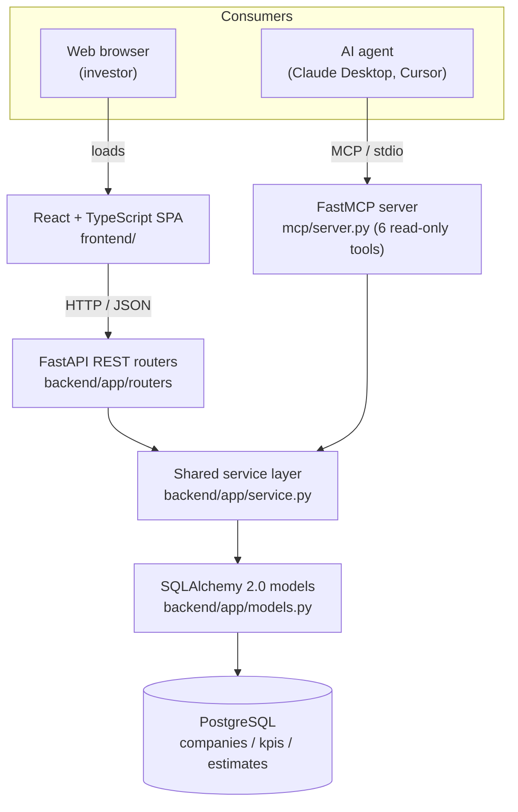
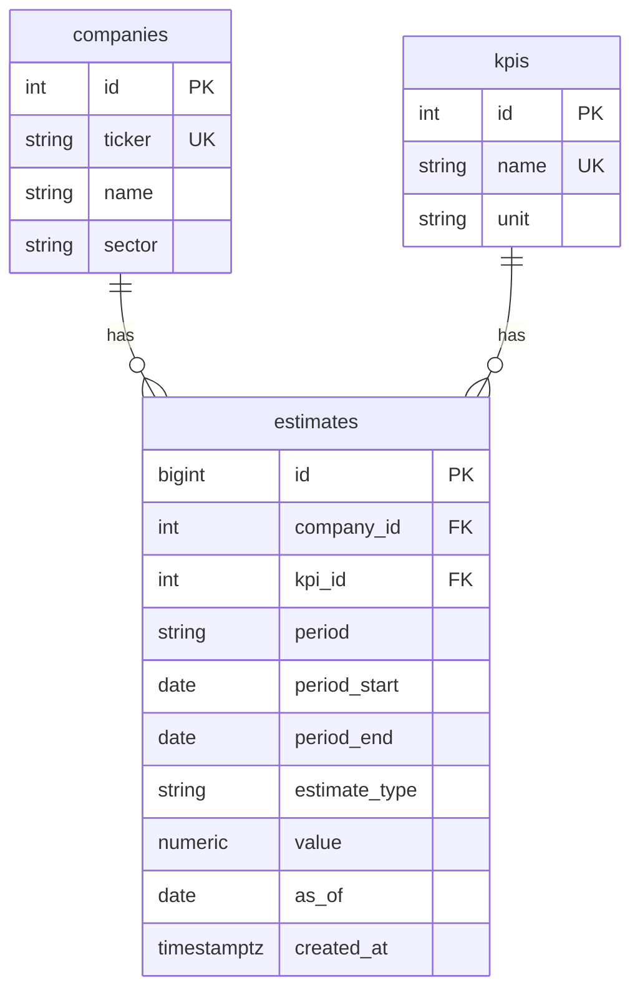

# Architecture

The architecture reference for the KPI Estimates Portal. The
[README](../README.md) covers how to run the project and summarizes the design;
this document goes deeper on the component layout, the data model, and the four
technical challenges the build set out to address.

## Component overview

The system has **two entry points over one shared core**:

- **REST API** (`backend/app`): FastAPI routers serve the web frontend. Routers
  are thin, they validate input with Pydantic, call one service function, and
  let exception handlers map domain errors to HTTP status codes.
- **MCP server** (`mcp/server.py`): a FastMCP server exposes the same data as
  six read-only tools for AI agents, over the Model Context Protocol on stdio.
- **Shared service layer** (`backend/app/service.py`): every KPI and QTD query
  lives here, written once. Both entry points import and call it. The MCP server
  imports the backend package in-process, so there is no second HTTP hop and no
  duplicated query logic. This is the structural answer to technical challenge 2.
- **PostgreSQL**: three normalized tables hold the estimates data.

The service layer is pure: each function takes a SQLAlchemy `Session` and
returns Pydantic models, so REST and MCP receive identical typed results. It
never opens, commits, or closes the session; the caller owns the transaction.

## Data model

The CSV repeats company and KPI attributes on every row. Normalizing into three
tables makes "company" and "KPI" first-class entities (the API and the UX revolve
around them) and removes that repetition; the cost is two cheap joins.

- **companies**: 20 rows. `ticker` is unique; `sector` is indexed for search.
- **kpis**: 5 rows. `unit` lives here because the KPI-to-unit mapping is a fixed
  1:1 invariant, guarded by a `CHECK` constraint.
- **estimates**: holds both historical and QTD rows, discriminated by
  `estimate_type`. `value` is `numeric` (exact, no float drift, financial data).
  A `CHECK` constraint enforces the QTD invariant: a `historical` row has no
  `as_of`, a `qtd` row must have one. `created_at` is the server-set audit
  timestamp, distinct from the domain `as_of`.

Two indexes on `estimates` serve the read paths:

1. `(company_id, kpi_id)`: the primary access path for company and series reads.
2. A partial index `(company_id, kpi_id, period, as_of DESC, created_at DESC)
   WHERE estimate_type = 'qtd'`: serves the QTD "latest snapshot" query.

## The QTD snapshot model

Modeling QTD correctly is the heart of the assignment.

For each `(company, KPI)` pair there is a time series with two parts:

- **History**: one value per closed fiscal quarter (16 quarters, 2022Q1 to
  2025Q4). `as_of` is null.
- **QTD (quarter-to-date)**: the in-progress quarter (2026Q1) is not a single
  value. It is several intra-quarter **snapshots**, each stamped with an `as_of`
  date, showing how the estimate evolved. The **current QTD** value is the
  snapshot with the latest `as_of`.

"Current QTD" is derived on read, never stored, so there is no second source of
truth for the publish endpoint to keep in sync. It is resolved with a PostgreSQL
`DISTINCT ON` ordered by `as_of DESC, created_at DESC, id DESC`:

- `as_of DESC` picks the most recent snapshot date.
- `created_at DESC` then `id DESC` break a tie when a correction is re-published
  at the same `as_of`. `id` is a `BIGSERIAL`, strictly monotonic with insert
  order, so it is the guaranteed-unique final tiebreak: the most recently
  written row always wins, even when two rows written in one transaction share a
  `created_at` (which happens because the default `created_at` is the
  transaction start time).

**Publishing** an estimate is **append-only**: `POST /estimates` inserts one row
and never updates or deletes. This preserves a full audit trail, matches the
snapshot model (a new QTD estimate *is* a new snapshot), and is safe without
authentication (the worst case is an extra row, resolved deterministically on
read).

## Request flow

A read request, for example `GET /companies/ACME/kpis/Total%20Revenue%20(%24MM)`:

1. The request-logging middleware assigns a `request_id`, starts a timer.
2. The router validates path and query parameters, opens a session via the
   `get_session` dependency.
3. The router calls one service function (`get_series`).
4. The service layer runs the indexed queries, assembles a Pydantic model.
5. The router returns it; FastAPI serializes it to JSON.
6. The middleware logs one structured JSON line (method, path, status,
   latency, request id) and sets the `X-Request-ID` response header.

An MCP tool call follows the same path from step 3 on: the tool opens its own
short-lived session and calls the identical service function.

## The four technical challenges

| Challenge | Where the design answers it |
|-----------|-----------------------------|
| The QTD / as-of point-in-time snapshot model | The `estimates` table with an `estimate_type` discriminator and a nullable `as_of`; current QTD derived with `DISTINCT ON` and the `as_of, created_at, id` tiebreak. |
| One shared data API for the frontend and the MCP server | `service.py`, imported in-process by both the REST routers and the MCP tools. Query logic is written exactly once. |
| MCP tools an LLM can use naturally | Six intent-shaped, read-only tools with LLM-facing docstrings, typed Pydantic return models (so FastMCP publishes an output schema), and truthful read-only annotations. |
| Fast, glanceable reads | Targeted indexes; the `GET /overview` endpoint is three constant-count queries assembled in Python, with no N+1 (a query-counting test proves it); the frontend code-splits the chart library and uses hand-rolled SVG sparklines. |
